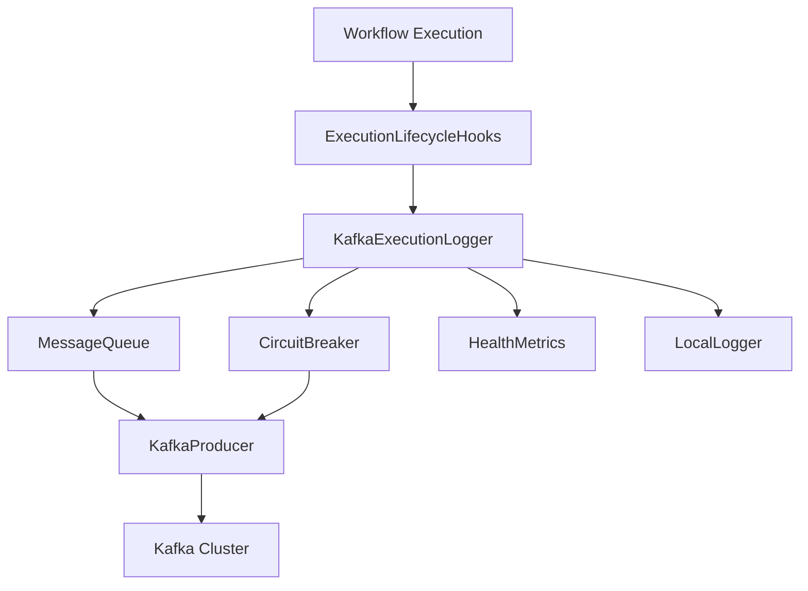

# Design Document

## Overview

The Kafka Execution Logger is a plugin that integrates with n8n's ExecutionLifecycleHooks system to capture workflow execution events and send them to a Kafka topic. The plugin is designed with operational safety as the primary concern, ensuring that Kafka connectivity issues never impact workflow execution performance or reliability.

The plugin leverages n8n's existing execution lifecycle hooks infrastructure and follows the established patterns for external integrations. It implements a robust queuing mechanism with circuit breaker patterns to handle Kafka outages gracefully.

All execution events are formatted as Segment.com track events, providing a standardized analytics event format that is compatible with downstream analytics tools and data pipelines. This format ensures consistency and enables easy integration with existing analytics infrastructure.

## Architecture

### High-Level Architecture



### Component Integration

The plugin integrates with n8n's execution lifecycle system by:

1. **Hook Registration**: Registering handlers for workflow execution events through the ModulesHooksRegistry
2. **Event Processing**: Processing execution events asynchronously to avoid blocking workflow execution
3. **Message Queuing**: Implementing an in-memory queue for reliable message delivery
4. **Circuit Breaking**: Using circuit breaker pattern to handle Kafka failures gracefully

## Components and Interfaces

### 1. KafkaExecutionLogger Service

**Purpose**: Main service class that orchestrates the logging functionality

**Key Responsibilities**:
- Register execution lifecycle hooks
- Process execution events asynchronously
- Manage Kafka producer lifecycle
- Coordinate with other components

**Interface**:
```typescript
interface IKafkaExecutionLogger {
  initialize(): Promise<void>;
  shutdown(): Promise<void>;
  handleWorkflowStart(context: WorkflowExecutionContext): Promise<void>;
  handleWorkflowComplete(context: WorkflowExecutionContext): Promise<void>;
  handleWorkflowError(context: WorkflowExecutionContext): Promise<void>;
}
```

### 2. MessageQueue Component

**Purpose**: In-memory queue for reliable message delivery with overflow protection

**Key Responsibilities**:
- Queue messages when Kafka is unavailable
- Implement FIFO with size limits
- Provide batch processing capabilities
- Handle queue overflow gracefully

**Interface**:
```typescript
interface IMessageQueue {
  enqueue(message: ExecutionLogMessage): boolean;
  dequeue(): ExecutionLogMessage | null;
  dequeueBatch(size: number): ExecutionLogMessage[];
  size(): number;
  clear(): void;
}
```

### 3. CircuitBreaker Component

**Purpose**: Prevent cascading failures when Kafka is unavailable

**Key Responsibilities**:
- Track Kafka operation success/failure rates
- Implement circuit breaker states (Closed, Open, Half-Open)
- Provide exponential backoff for retry attempts
- Expose circuit state for monitoring

**Interface**:
```typescript
interface ICircuitBreaker {
  execute<T>(operation: () => Promise<T>): Promise<T>;
  getState(): CircuitBreakerState;
  getMetrics(): CircuitBreakerMetrics;
}
```

### 4. KafkaProducer Wrapper

**Purpose**: Safe wrapper around Kafka producer with timeout and error handling

**Key Responsibilities**:
- Manage Kafka producer connection lifecycle
- Implement message sending with timeouts
- Handle authentication and SSL configuration
- Provide connection health checks

**Interface**:
```typescript
interface IKafkaProducerWrapper {
  connect(): Promise<void>;
  disconnect(): Promise<void>;
  send(message: ExecutionLogMessage): Promise<void>;
  sendBatch(messages: ExecutionLogMessage[]): Promise<void>;
  isConnected(): boolean;
}
```

### 5. HealthMetrics Component

**Purpose**: Track and expose operational metrics for monitoring

**Key Responsibilities**:
- Count successful/failed message sends
- Track queue depth and circuit breaker state
- Provide health check endpoints
- Log operational statistics

**Interface**:
```typescript
interface IHealthMetrics {
  incrementSuccess(): void;
  incrementFailure(): void;
  setQueueDepth(depth: number): void;
  setCircuitBreakerState(state: CircuitBreakerState): void;
  getMetrics(): HealthMetricsSnapshot;
}
```

## Data Models

### ExecutionLogMessage (Segment.com Track Event Format with Context Suite Extensions)

```typescript
interface ExecutionLogMessage {
  // Segment.com standard fields
  type: 'track';
  event: 'Workflow Started' | 'Workflow Completed' | 'Workflow Failed' | 'Workflow Cancelled';
  userId?: string; // actual n8n user ID who triggered the workflow
  anonymousId?: string; // fallback if no userId available
  timestamp: string; // ISO 8601 format
  messageId: string; // random UUID for deduplication
  
  // Context Suite Extensions to Segment.com
  dimensions: {
    execution_mode: string; // 'manual', 'trigger', 'webhook', etc. (low cardinality)
    status?: string; // 'success', 'error', 'cancelled', 'waiting' (low cardinality)
    version?: string; // n8n version like '1.0.0' (low cardinality)
    environment?: string; // 'production', 'staging', 'development' (low cardinality)
    trigger_type?: string; // 'manual', 'schedule', 'webhook', etc. (low cardinality)
    workflow_name: string; // workflow names are typically low cardinality for BI breakdowns
    error_type?: string; // error categories like 'NodeOperationError', 'ValidationError' (low cardinality)
  };
  flags: {
    is_manual_execution: boolean;
    is_retry: boolean;
  };
  metrics: {
    duration_ms?: number;
    node_count: number;
  };
  tags: string[]; // workflow_tags?: string[];
  involves: [
    {
      role: 'WorkflowExecution';
      id: string; // executionId
      id_type: 'n8n';
    },
    {
      role: 'Workflow';
      id: string; // workflowId
      id_type: 'n8n';
    }
  ];
  
  // Standard Segment.com properties object
  properties: {
    // High-cardinality identifiers (moved from dimensions)
    trigger_node?: string;
    retry_of?: string;
    
    // Timing
    started_at: string;
    finished_at?: string;
    
    // Error details (for failed executions)
    error_message?: string;
    error_stack?: string;
    error_node_id?: string;
    error_node_name?: string;
    
    workflow_version?: string; //number
  };
  
  // Segment.com context object
  context: {
    app: {
      name: 'n8n';
      version: string;
    };
    library: {
      name: 'n8n-kafka-execution-logger';
      version: string;
    };
    instance: {
      id: string;
      type: 'main' | 'worker';
    };
    // Additional n8n-specific context
    n8n: {
      execution_mode: WorkflowExecuteMode;
      instance_type: 'main' | 'worker';
    };
  };  
}
```

### Configuration Model

```typescript
interface KafkaLoggerConfig {
  enabled: boolean;
  kafka: {
    brokers: string[];
    clientId: string;
    topic: string;
    ssl: boolean;
    authentication?: {
      username: string;
      password: string;
      mechanism: 'plain' | 'scram-sha-256' | 'scram-sha-512';
    };
  };
  queue: {
    maxSize: number;
    batchSize: number;
    flushInterval: number;
  };
  circuitBreaker: {
    failureThreshold: number;
    resetTimeout: number;
    monitoringPeriod: number;
  };
  timeouts: {
    connect: number;
    send: number;
    disconnect: number;
  };
}
```

## Error Handling

### Error Categories and Responses

1. **Configuration Errors**
   - Invalid Kafka configuration
   - Missing required environment variables
   - Response: Log error and disable plugin

2. **Connection Errors**
   - Kafka broker unavailable
   - Authentication failures
   - Response: Activate circuit breaker, queue messages

3. **Message Sending Errors**
   - Timeout during send operation
   - Kafka topic doesn't exist
   - Response: Retry with exponential backoff, then queue

4. **Queue Overflow**
   - Memory queue reaches capacity
   - Response: Drop oldest messages, log warning

5. **Serialization Errors**
   - Invalid message format
   - Response: Log error, skip message

### Error Recovery Strategies

- **Exponential Backoff**: Implement exponential backoff for retry attempts
- **Circuit Breaker**: Prevent cascading failures during Kafka outages
- **Graceful Degradation**: Continue workflow execution even when logging fails
- **Local Fallback**: Log critical errors to local file system when Kafka is unavailable

## Testing Strategy

### Unit Testing

1. **Component Testing**
   - Test each component in isolation
   - Mock external dependencies (Kafka, file system)
   - Verify error handling paths

2. **Message Processing Testing**
   - Test message serialization/deserialization
   - Verify Segment.com track event format compliance
   - Test edge cases (null values, large messages)
   - Validate required Segment.com fields (type, event, timestamp, messageId)

3. **Circuit Breaker Testing**
   - Test state transitions
   - Verify failure threshold behavior
   - Test recovery scenarios

### Integration Testing

1. **Kafka Integration**
   - Test with real Kafka cluster
   - Verify authentication mechanisms
   - Test SSL/TLS connections

2. **n8n Integration**
   - Test hook registration
   - Verify execution event capture
   - Test with different workflow types

3. **Failure Scenarios**
   - Test Kafka unavailability
   - Test network partitions
   - Test authentication failures

### Performance Testing

1. **Load Testing**
   - Test with high-frequency workflow executions
   - Measure memory usage under load
   - Verify queue performance

2. **Latency Testing**
   - Measure impact on workflow execution time
   - Test message sending latency
   - Verify timeout behavior

### Operational Testing

1. **Health Check Testing**
   - Test health endpoint responses
   - Verify metrics accuracy
   - Test monitoring integration

2. **Configuration Testing**
   - Test environment variable handling
   - Verify configuration validation
   - Test dynamic configuration updates

## Implementation Considerations

### Environment Variables

```bash
# Core Configuration
N8N_KAFKA_LOGGER_ENABLED=true
N8N_KAFKA_LOGGER_BROKERS=kafka1:9092,kafka2:9092
N8N_KAFKA_LOGGER_CLIENT_ID=n8n-execution-logger
N8N_KAFKA_LOGGER_TOPIC=n8n-executions

# Authentication
N8N_KAFKA_LOGGER_SSL=true
N8N_KAFKA_LOGGER_AUTH_ENABLED=true
N8N_KAFKA_LOGGER_USERNAME=n8n-logger
N8N_KAFKA_LOGGER_PASSWORD=secret
N8N_KAFKA_LOGGER_SASL_MECHANISM=scram-sha-256

# Queue Configuration
N8N_KAFKA_LOGGER_QUEUE_MAX_SIZE=10000
N8N_KAFKA_LOGGER_QUEUE_BATCH_SIZE=100
N8N_KAFKA_LOGGER_QUEUE_FLUSH_INTERVAL=5000

# Circuit Breaker
N8N_KAFKA_LOGGER_CB_FAILURE_THRESHOLD=5
N8N_KAFKA_LOGGER_CB_RESET_TIMEOUT=60000
N8N_KAFKA_LOGGER_CB_MONITORING_PERIOD=30000

# Timeouts
N8N_KAFKA_LOGGER_TIMEOUT_CONNECT=10000
N8N_KAFKA_LOGGER_TIMEOUT_SEND=5000
N8N_KAFKA_LOGGER_TIMEOUT_DISCONNECT=5000
```

### File Structure

```
packages/cli/src/kafka-execution-logger/
├── kafka-execution-logger.service.ts
├── components/
│   ├── message-queue.ts
│   ├── circuit-breaker.ts
│   ├── kafka-producer-wrapper.ts
│   └── health-metrics.ts
├── models/
│   ├── execution-log-message.ts
│   └── kafka-logger-config.ts
├── utils/
│   ├── config-loader.ts
│   ├── message-serializer.ts
│   └── segment-event-builder.ts
└── __tests__/
    ├── kafka-execution-logger.service.test.ts
    └── components/
        ├── message-queue.test.ts
        ├── circuit-breaker.test.ts
        └── kafka-producer-wrapper.test.ts
```

### Dependencies

- **kafkajs**: Kafka client library (already used in n8n)
- **@n8n/di**: Dependency injection (existing)
- **n8n-core**: Core execution hooks (existing)
- **uuid**: For generating Segment.com messageId fields

### Performance Considerations

1. **Asynchronous Processing**: All Kafka operations must be asynchronous to avoid blocking workflow execution
2. **Memory Management**: Implement queue size limits to prevent memory exhaustion
3. **Connection Pooling**: Reuse Kafka producer connections across executions
4. **Batch Processing**: Send messages in batches to improve throughput
5. **Timeout Management**: Implement aggressive timeouts to prevent hanging operati